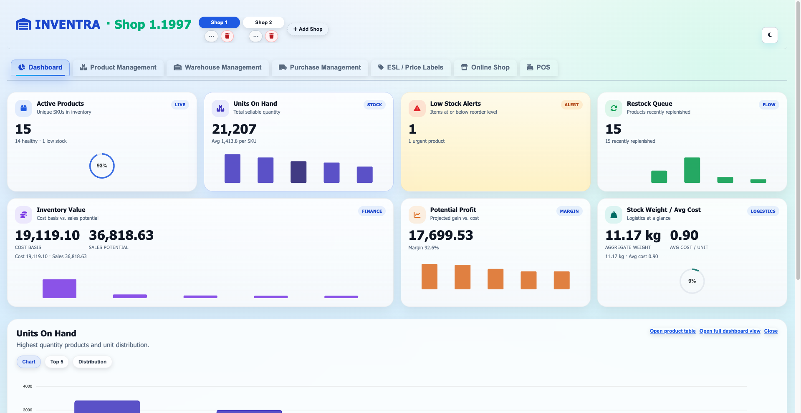
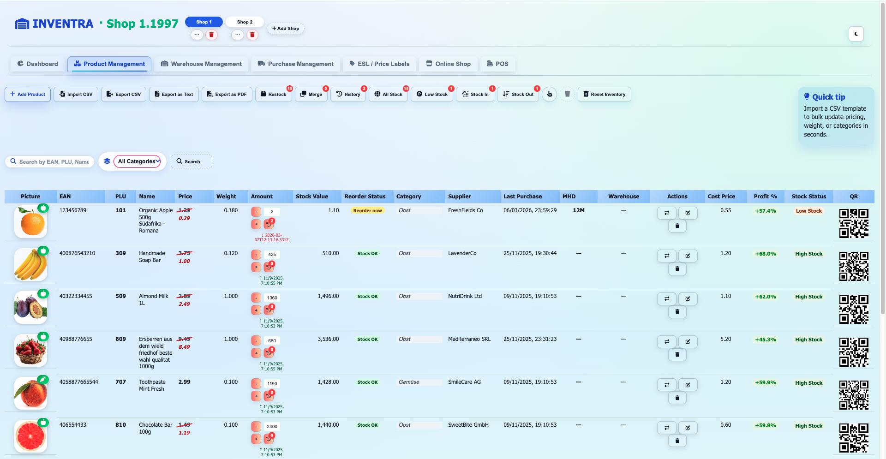
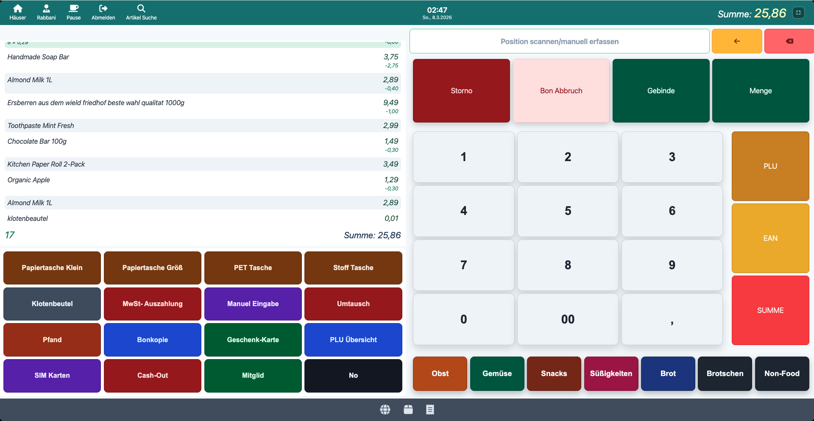
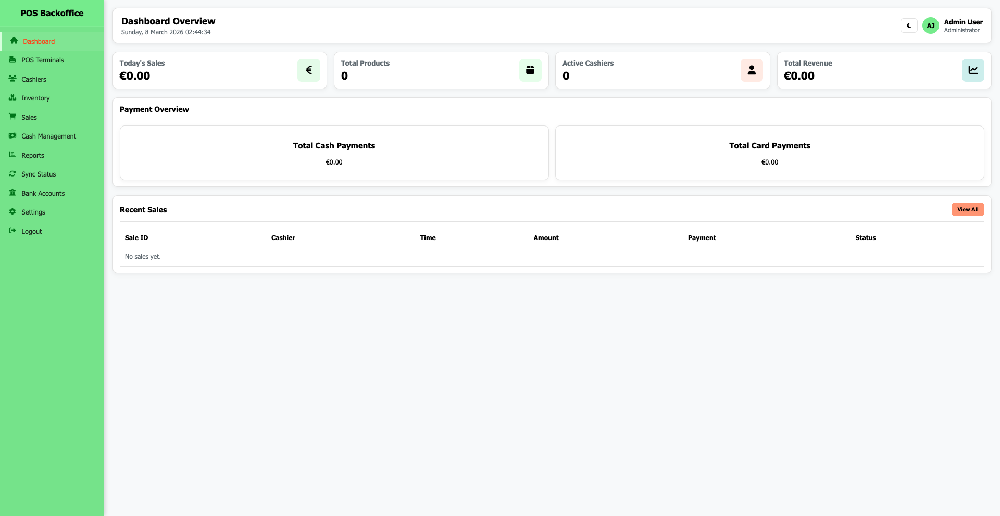

# IVMS — Integrated Inventory, POS, Storefront & Backoffice Platform

<p align="center">
  <b>A full-stack retail operations platform for inventory, POS, S-Go POS, storefront management, backoffice workflows, promotions, auto-generated prospectus automation, and multi-shop management.</b>
</p>

<p align="center">
  
  
  
  
  
  
</p>

---

## Overview

**IVMS** is a unified **retail operations platform** that combines multiple business-critical tools into one connected system.

Instead of building isolated pages, this project was designed as a **shared platform** where all major interfaces connect to the same backend and database. That means products, stock, pricing, shops, purchases, inventory movements, and operational workflows remain synchronized across the whole ecosystem.

The platform includes:

- **Inventory management console**
- **Backoffice / admin interface**
- **POS (Point of Sale) system**
- **Customer-facing storefront**
- **Prospectus / promotions workspace**
- **Central API and database backend**

This makes IVMS much more than a normal CRUD app. It is a **multi-surface retail platform** built around one shared source of truth.

---

## Why this project stands out

This repository is strong because it demonstrates **system-level thinking**, not just page-level coding.

It combines:

- inventory management
- multi-shop operations
- admin workflows
- customer-facing retail UI
- POS-style interactions
- purchase and warehouse processes
- promotional tooling
- one shared backend and database architecture

That makes it far more realistic than a basic tutorial app.

---

## Architecture

```text
                         ┌───────────────────────────┐
                         │        MongoDB            │
                         │   Products / Shops /      │
                         │ Purchases / Users / Logs  │
                         └─────────────┬─────────────┘
                                       │
                                       │
                          ┌────────────▼────────────┐
                          │   Node.js + Express API │
                          │  Auth / Products /      │
                          │  Shops / Purchases /    │
                          │  Warehouses / History   │
                          └───────┬───────┬─────────┘
                                  │       │
               ┌──────────────────┘       └──────────────────┐
               │                                             │
     ┌─────────▼─────────┐                         ┌─────────▼─────────┐
     │  IVMS Console     │                         │   Backoffice SPA  │
     │ Inventory / KPIs  │                         │ Admin / Sales /   │
     │ Warehouse / Shop  │                         │ Cashier / Reports │
     └─────────┬─────────┘                         └───────────────────┘
               │
     ┌─────────┼─────────┬───────────────────────────────┐
     │         │         │                               │
┌────▼────┐ ┌──▼──────┐ ┌▼────────────┐            ┌─────▼──────────┐
│  POS    │ │Storefront│ │ Prospectus │            │ Shared Frontend │
│ Register│ │ Catalog   │ │ Promotions │            │ Static Delivery │
└─────────┘ └───────────┘ └────────────┘            └────────────────┘
```
### Core architecture

This project follows a shared-data architecture:

The backend stores and serves products, shops, purchases, warehouse activity, and history.

The IVMS console consumes those APIs for inventory and operations.

The storefront reads the same product and shop data for customer-facing browsing.

The POS can use the same API host and active shop context for article lookup and transaction-related flows.

The backoffice acts as a business operations SPA and also talks to the same backend.

The prospectus workspace can pull promotional and inventory data to build marketing content.

That makes IVMS a unified retail platform rather than a collection of unrelated pages.

### Platform modules
1. Central backend and database

The backend is the shared source of truth for the whole platform. It handles API routing, database access, shop-aware data, product management, purchases, history, warehouses, and authentication. The main server mounts the API and serves the static frontends for the storefront, POS, and backoffice from the same application.

2. IVMS frontend console

The IVMS console is the main operational cockpit for staff. It includes dashboard KPIs, inventory management, transfers, purchases, ESL-related tools, shop-aware product operations, image handling, inline editing, and keyboard shortcuts. The main shell is defined in index.html, while the behavior is split across focused helper files such as script.js, addshop.js, updatepage.js, excelInlineEdit.js, picture.js, and Key_Shortcut.js.

3. POS interface

The POS module provides a browser-based point-of-sale experience with login and lockscreen flow, article lookup, keypad interaction, session persistence, and register-oriented screen logic.

4. Storefront / online shop

The storefront is the customer-facing catalog interface. It is designed as a lightweight static frontend that reads live product and shop data from the shared API, displays inventory in a polished layout, and supports search, sort, category filters, availability filters, and quick stock request actions. The storefront shell is defined in index.html and powered by shop.js.

5. Backoffice SPA

The backoffice is a single-page staff and admin interface focused on dashboards, terminals, cashiers, inventory, reporting, payments, and other business-side workflows. The current backoffice.html contains the SPA layout and a large amount of inline styling and behavior.

6. Prospectus / promotions workspace

The prospectus workspace is used to design promotional layouts and marketing pages. The uploaded propectas.html includes editing tools, company profile storage, modal interactions, discount and product loading, zoom support, and client-side persistence. In the current state, much of this logic is embedded directly in the HTML file rather than split into separate CSS and JS assets.

## Technology Landscape

<div align="center">

| Platform Layer | Technologies |
|---|---|
| **Backend Services** | Node.js, Express, MongoDB, Mongoose, ES Modules |
| **Frontend Applications** | HTML, CSS, Vanilla JavaScript |
| **Client-Side Persistence** | LocalStorage, IndexedDB |
| **UI & Interaction** | Font Awesome, browser-native UI modules, QR / barcode / chart helpers |
| **Runtime & Developer Tooling** | dotenv, CORS, Morgan |

</div>

### Engineering Approach
- **Unified platform architecture** with a shared backend serving multiple operational interfaces
- **API-first integration model** connecting internal tools, POS, storefront, and promotional workflows
- **Multi-shop aware request handling** through shop-scoped data access and context-based operations
- **Browser-native frontend delivery** with lightweight modules and no mandatory bundler dependency
- **Express-served static applications** for simplified deployment and centralized platform delivery

---

## Core Business Capabilities

### Inventory Operations
- Centralized product catalog management
- Stock editing, updates, and inventory control
- Shop-aware inventory workflows across multiple outlets
- Search, filtering, and pagination for large product datasets
- Inline editing for faster operational updates
- Product image handling and CSV-based support utilities
- Controlled inventory reset workflow with confirmation safeguards
- Transfer queue and retry handling within the IVMS console

### Operational Intelligence & Control
- KPI dashboards and executive overview panels
- Multi-tab operational cockpit for day-to-day workflows
- Purchase and warehouse activity visibility
- Status indicators, alerts, and notification support
- Keyboard shortcuts and workflow acceleration utilities

### Multi-Shop Administration
- Shop-scoped request handling
- Shop metadata loading and persistence
- Outlet-aware data targeting across platform modules
- POS fallback logic for shop selection and active context handling

### Storefront Commerce Experience
- Customer-facing product catalog presentation
- Search, sorting, category filtering, and availability filtering
- Shop-specific storefront rendering
- Request-stock workflow for customer and sales-side interaction

### Point of Sale
- Login and lockscreen workflow
- Soft keypad and register-style numeric input
- Product and article lookup flows
- Session persistence through LocalStorage
- Shared API base awareness aligned with the wider platform

### Backoffice Administration
- Dashboard widgets and business overview screens
- Sales visibility and staff-facing management views
- POS terminal administration
- Cashier management workflows
- Business and administrative process screens

### Prospectus & Promotional Workspace
- Editable promotion canvas for marketing content
- Company profile persistence
- Discount and promotional product loading
- Zoom and presentation controls
- Modal-based editing and prospectus composition workflows

### Project structure

```text
ivms-platform/
├── package.json
├── package-lock.json
├── README.md
├── .env
├── .env.example
│
├── src/                                 # Backend / API layer
│   ├── index.js                         # Express app entry point
│   ├── db.js                            # Database connection
│   │
│   ├── middleware/                      # Cross-cutting backend middleware
│   │   └── auth.js                      # Authentication / request protection
│   │
│   ├── models/                          # Database models / schemas
│   │   ├── product.js                   # Product data model
│   │   ├── purchaseOrder.js             # Purchase order model
│   │   ├── shop.js                      # Shop / outlet model
│   │   └── user.js                      # User / access model
│   │
│   ├── routes/                          # API route modules
│   │   ├── auth.js                      # Authentication routes
│   │   ├── products.js                  # Product and inventory routes
│   │   ├── purchases.js                 # Purchase workflow routes
│   │   ├── shops.js                     # Shop management routes
│   │   ├── warehouses.js                # Warehouse-related routes
│   │   └── history.js                   # Stock / audit history routes
│   │
│   └── utils/                           # Shared backend utilities
│       ├── csv.js                       # CSV import / export helpers
│       ├── password.js                  # Password hashing / validation
│       └── token.js                     # Token / auth helpers
│
├── frontend/                            # Frontend applications
│   ├── ivms/                            # Main inventory & operations console
│   │   ├── index.html                   # Main application shell
│   │   ├── index.css                    # Global UI styling
│   │   ├── dashbord.css                 # Dashboard-specific styling
│   │   ├── script.js                    # Core app state / rendering logic
│   │   ├── addshop.js                   # Shop switching / shop-aware logic
│   │   ├── updatepage.js                # Pagination helpers
│   │   ├── excelInlineEdit.js           # Inline editing workflow
│   │   ├── helper.js                    # Shared UI / browser helpers
│   │   ├── picture.js                   # Product image handling
│   │   ├── restinventory.js             # Inventory reset workflow
│   │   ├── Key_Shortcut.js              # Keyboard shortcut support
│   │   ├── serchproduct.js              # Search and filtering logic
│   │   └── public/                      # IVMS static assets
│   │
│   ├── storefront/                      # Customer-facing online shop
│   │   ├── index.html                   # Storefront page shell
│   │   ├── style.css                    # Storefront styling
│   │   ├── shop.js                      # Catalog rendering / filters
│   │   └── public/                      # Storefront static assets
│   │
│   ├── onlineshop/                      # Additional online shop frontend
│   │   ├── onlineshop.html              # Online shop page
│   │   ├── onlineshop.css               # Online shop styling
│   │   ├── onlineshop.js                # Online shop logic
│   │   └── public/                      # Online shop static assets
│   │
│   ├── pos/                             # Point-of-sale interface
│   │   ├── pos.html                     # POS screen layout
│   │   ├── pos.css                      # POS styling
│   │   ├── pos.js                       # POS interactions / session logic
│   │   └── public/                      # POS images / slideshow assets
│   │
│   ├── backoffice/                      # Admin / business operations SPA
│   │   ├── backoffice.html              # Backoffice SPA shell
│   │   ├── backoffice.css               # Backoffice styling
│   │   ├── backoffice.js                # Backoffice application logic
│   │   └── public/                      # Backoffice static assets
│   │
│   └── prospectus/                      # Promotions / prospectus workspace
│       ├── prospectus.html              # Prospectus editor workspace
│       ├── prospectus.css               # Prospectus styling
│       ├── prospectus.js                # Prospectus interactions / logic
│       └── public/                      # Prospectus static assets
│
├── uploads/                             # Uploaded runtime assets / product images
│
└── docs/                                # Project documentation
    └── screenshots/                     # UI previews and repository visuals
```

## Platform Composition

### Backend Services
The backend layer is built around a centralized Node.js and Express service that manages platform routing, database connectivity, authentication, product operations, purchase workflows, warehouse activity, shop management, history tracking, and shared utility functions.

**Core backend components**
- `index.js` — application entry point and server bootstrap
- `db.js` — database connection and initialization
- `auth.js` — authentication middleware or route logic
- `product.js`, `purchaseOrder.js`, `shop.js`, `user.js`, `purchaseItems.js` — domain models
- `products.js`, `purchases.js`, `shops.js`, `warehouses.js`, `history.js` — API resource modules
- `csv.js`, `password.js`, `token.js` — shared backend utilities

### Frontend Applications
The frontend layer is separated into multiple business-focused interfaces, each designed for a specific operational context across the platform.

**Application areas**
- **IVMS Console** — internal inventory and operations workspace
- **Storefront / Online Shop** — customer-facing catalog and product browsing experience
- **POS** — point-of-sale register interface
- **Backoffice** — business and administration workspace
- **Prospectus** — promotional and prospectus editing workspace

---

## Backend Overview

The backend acts as the **core service layer** of the platform.

### Service Responsibilities
- Initialize and run the Express application
- Connect the platform to MongoDB
- Expose REST API resources for auth, products, purchases, shops, warehouses, and history
- Serve static frontend applications from a centralized backend process
- Maintain a shared source of truth across all business interfaces

### Primary API Resources
- `/api/auth`
- `/api/products`
- `/api/purchases`
- `/api/shops`
- `/api/warehouses`
- `/api/history`
- `/api/health`

### Data & Security
MongoDB stores the platform’s core business entities including products, purchases, shops, and users. The service also supports default shop normalization for legacy data. Authentication, token utilities, and protected route handling are already present, though production-grade hardening should be part of the final deployment roadmap.

---

## IVMS Operational Console

The IVMS console is the platform’s **primary internal operations workspace**, designed for inventory control, workflow visibility, and staff productivity.

### Core Responsibilities
- Dashboard and KPI visibility
- Product and stock management
- Purchase and warehouse workflows
- Transfer tracking and operational support
- ESL / preview-related tooling
- Shop-aware inventory actions
- Bulk update utilities
- Productivity enhancements such as inline editing and keyboard shortcuts

### Key Application Files
- `index.html` — main shell and tab-driven UI structure
- `script.js` — application state, rendering, loaders, and shared logic
- `index.css` — shared interface styling
- `dashbord.css` — dashboard-specific presentation
- `addshop.js` — shop switching and shop-context logic
- `updatepage.js` — pagination handling
- `excelInlineEdit.js` — inline editing workflow
- `picture.js` — image and media-related utilities
- `restinventory.js` — safeguarded inventory reset flow
- `Key_Shortcut.js` — keyboard productivity layer
- `helper.js` — shared browser and UI helpers
- `serchproduct.js` — product search and filtering logic

### Business Value
This module demonstrates an enterprise-style internal application approach by combining operational visibility, workflow efficiency, shop-aware state handling, and staff tooling within a single management console.

---

## Storefront / Online Shop

The storefront layer represents the **customer-facing commerce experience** of the platform.

### Included Components
- `index.html`, `shop.js`, `style.css`
- `onlineshop.html`, `onlineshop.css`, `onlineshop.js`

### Business Role
This area provides searchable, filterable, shop-aware product presentation for customer or sales-facing usage, extending the platform beyond internal operations into retail-facing digital experiences.

---

## POS Interface

The POS module represents the **register-side sales interface**.

### Included Components
- `pos.html`
- `pos.js`

### Business Role
This interface supports POS-oriented workflows such as lockscreen handling, keypad-driven input, product lookup, and temporary session control, giving the platform a direct operational sales layer.

---

## Backoffice Workspace

The backoffice module represents the **administrative and business operations interface**.

### Included Components
- `backoffice.html`

### Business Role
This area is intended for dashboards, reporting, cashier workflows, terminal visibility, and broader business-side operational management.

---

## Prospectus Workspace

The prospectus module represents the **promotional and marketing workspace**.

### Included Components
- `propectas.html`

### Business Role
This interface supports prospectus composition, promotional content editing, discount presentation, and marketing-oriented layout workflows, adding a merchandising layer to the broader platform.

## Business Value by Platform Module

### IVMS Operational Console
The IVMS console delivers the platform’s **core operational control layer**. Rather than acting as a basic CRUD dashboard, it supports real business workflows through shared state handling, inventory operations, fallback logic, retry-oriented processes, productivity utilities, and shop-aware execution. This makes it a strong example of an internal enterprise application designed for day-to-day operational efficiency.

---

### Storefront
The storefront represents the platform’s **customer-facing digital commerce layer**. It transforms internal inventory data into a clean, searchable, and business-ready catalog experience with stock visibility, pricing presentation, filtering, and shop-specific product discovery.

#### Core Responsibilities
- Product catalog presentation
- Stock and pricing visibility
- Search, sorting, and filtering
- Request-stock interaction
- Shop-specific catalog delivery

#### Business Value
This module demonstrates that the platform’s data model is reusable beyond internal staff tools. It extends the system into a customer-facing experience, showing how the same operational backend can support commerce, product discovery, and sales enablement in a polished frontend layer.

---

### POS
The POS module delivers the platform’s **transaction-side retail interface**. It provides a kiosk-style sales experience with register-oriented interaction patterns such as keypad input, product lookup, session handling, and access control.

#### Core Responsibilities
- POS lock and unlock workflow
- Keypad-driven input handling
- Product and article lookup
- Active basket / scanned item flow
- Temporary session persistence
- Shared API base alignment with the wider platform

#### Business Value
This module elevates the project beyond inventory administration into real operational retail execution. It demonstrates the ability to design task-focused sales interfaces, which is a distinct product challenge compared with dashboards or catalog screens, and strengthens the platform’s enterprise credibility.

---

### Backoffice SPA
The backoffice provides the platform’s **administrative and business management layer**. It supports dashboards, reporting visibility, cashier-related workflows, terminal views, and broader business-side operational control.

#### Core Responsibilities
- Management dashboard visibility
- Terminal-related operational views
- Sales-facing monitoring screens
- Cashier workflow support
- Modal-driven SPA navigation and business administration flows

#### Business Value
This module adds an executive and administrative dimension to the platform by supporting management-facing workflows in addition to frontline operations. It strengthens the system’s value as a multi-role business platform rather than a single-purpose operational tool.

#### Architecture Note
In the current uploaded version, `backoffice.html` still contains inline CSS and JavaScript. For stronger maintainability and production readiness, this area should be modularized into dedicated `backoffice.css` and `backoffice.js` assets where applicable.

---

### Prospectus Workspace
The prospectus module represents the platform’s **promotional and merchandising workspace**. It is designed to connect operational product data with marketing-oriented presentation workflows.

#### Core Responsibilities
- Promotional layout editing
- Company profile persistence
- Discount and product loading
- Zoom and presentation controls
- Marketing-oriented content composition

#### Business Value
This module adds a high-value commercial layer to the project by showing that the platform is not limited to inventory control and sales execution. It also supports merchandising, promotion, and presentation workflows, which makes the overall solution more complete and more aligned with real retail business operations.

Screenshots
```text
## Screenshots

### IVMS Dashboard


### Inventory Management


### POS Interface


### Storefront


### Backoffice


### Prospectus Workspace

```
## Getting Started

IVMS is designed to run as a **single integrated platform** during local development.  
Because the Express server also delivers the frontend applications, you can launch the backend once and access multiple business interfaces from the same runtime environment.

### Local Setup

1. **Install project dependencies**
   ```bash
   npm install```

## Create your environment configuration
Add a .env file in the project root and provide the required runtime variables for your local environment.

Ensure MongoDB is available
Start your local MongoDB instance before launching the application.

Start the platform

```npm run dev```

or

```npm start```
Available Local Interfaces

### Once the server is running, the platform frontends can be accessed directly through the backend service:

Storefront: ```http://localhost:4000/storefront/```

POS: ```http://localhost:4000/pos/pos.html```

Backoffice: ```http://localhost:4000/backoffice/backoffice.html ```

### This unified startup flow simplifies development, testing, and module validation by allowing the backend and frontend applications to run together without requiring separate local hosting for each interface.

### Summary

# IVMS is a unified retail operations platform built on one central backend and multiple role-specific frontend applications. It brings together internal operations, customer-facing commerce, POS workflows, administrative tooling, and promotional content management within a single connected ecosystem.

## From an engineering and product perspective, the platform already demonstrates strong practical value through:

# multi-interface system design

# shared data architecture

# business-oriented workflow coverage

# customer-facing and internal-facing application layers

# operational scalability potential

### With continued structure refinement, production hardening, and stronger visual documentation, IVMS has the potential to evolve from a strong portfolio project into a highly compelling enterprise-style platform presentation.
